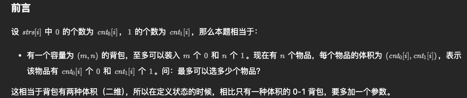

#%%
## 谈谈券系统 你做这个系统有什么制约或者困难 遇到了哪些问题 性能优化这一块 做了什么 后面又遇到了哪些难题 
## 怎么做到让别人容易上手的 怎么划分模块的 
## 资源位的通用可编排怎么做的 
## 怎么解决任务规则的更新的 
## 有没有遇到更新规则的时候请求变慢的情况（无锁设计？） 
## 算法题   
1. 二进制字符串集合的子集 ，m个0和n个1; [474 一和零](https://leetcode.cn/problems/ones-and-zeroes/description/)  

2. horse 到ros 的编辑距离; [72 编辑距离](https://leetcode.cn/problems/edit-distance/description/)
3. 矩阵左上角到右下角的最大值，类似题: [64 最小路径和](https://leetcode.cn/problems/minimum-path-sum/description/)